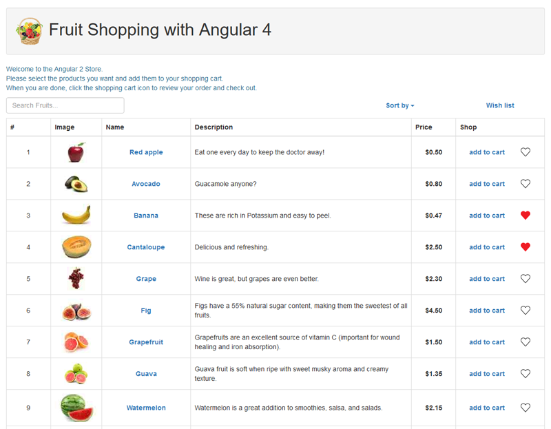

# Fruit Shopping App

## Development server

Run `ng serve` for a dev server. Navigate to `http://localhost:4200/`. The app will automatically reload if you change any of the source files.

Run `ng build` to build the project. The build artifacts will be stored in the `dist/` directory. Use the `-prod` flag for a production build.

## More info
**Fruit Shopping App** is created following the instructions and recommendations of a workshop meeting in Boston.
Workshop template app is [contacts-app](https://github.com/lekova/contacts-app) and it is to be followed as an example. The app that has to be build for the work shop is a shopping app. Slides for the workshop are [here](https://magodu.github.io/contacts-app-slides).